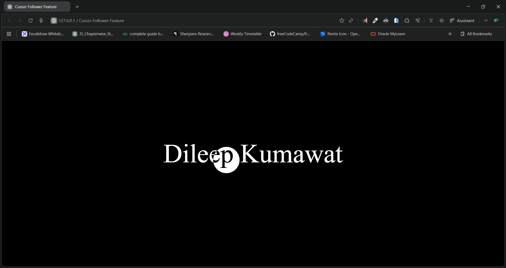

# 🚀 Cursor Follower Feature

An elegant and minimal interactive cursor-following animation built with **HTML, CSS, and JavaScript**.
The cursor smoothly follows the mouse pointer and expands when hovering over the displayed text.

---

## 📸 Preview



---

## 🎥 Demo Video

🎬 **Demo Video:** [click to watch](https://youtu.be/L_nXASgjZN8)

---

## 🌐 Live Demo

🔗 **Live Link:** []()

---

## ✨ Features

* 🖱️ Smooth cursor-following animation
* 🔵 Interactive hover effect (cursor enlarges on text)
* 🌓 Modern design using `mix-blend-mode`
* ⚡ Lightweight — no external JS libraries
* 💻 Fully responsive

---

## 📂 Project Structure

```
index.html
└── Contains complete HTML, CSS & JavaScript for the cursor interaction
```

---

## 🧠 How It Works

### ✔ Custom Cursor

A small white circular div follows the mouse:

```js
main.addEventListener("mousemove", (dets) => {
    cursor.style.top = dets.y + "px"
    cursor.style.left = dets.x + "px"
});
```

### ✔ Hover Expand Effect

The cursor enlarges when hovering the text:

```js
p.addEventListener("mouseenter", () => {
    cursor.style.height = "5rem";
    cursor.style.width = "5rem";
});
```

---

## 🛠️ Technologies Used

* **HTML** – Structure
* **CSS** – Styling & animations
* **JavaScript** – Cursor interaction logic

---

## 📦 Installation & Usage

Clone the repo:

```bash
git clone https://github.com/Dileep-kumawat/custom-cursor-follower-using-html-css-and-js.git
```

Open the project:

```bash
cd your-repo
```

Run in the browser:

```bash
open index.html
```

---

## 🤝 Contributing

Feel free to fork the project and make enhancements! Pull requests are welcome.

---

## 🧑‍💻 Author

👤 **Dileep kumawat**
- 📧 [dileepkumawat525@gmail.com](mailto:dileepkumawat525@gmail.com)
- 🔗 [LinkedIn](https://www.linkedin.com/in/dileep-kumawat/)

---

## 📄 License

This project is licensed under the **MIT License**.